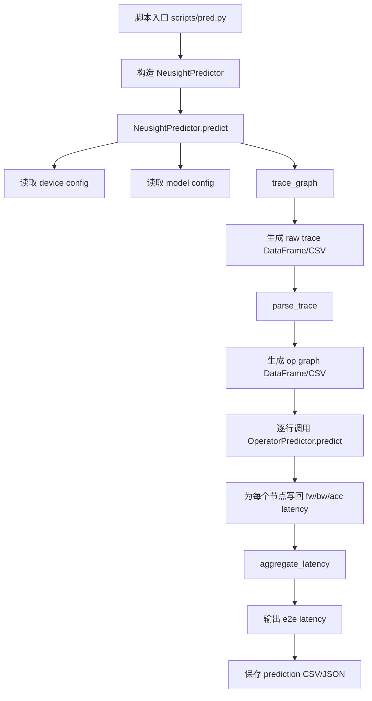
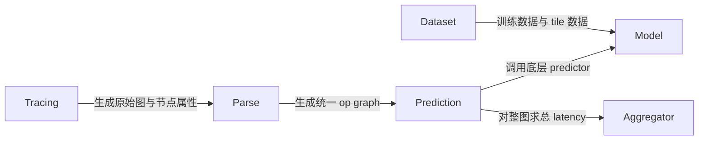
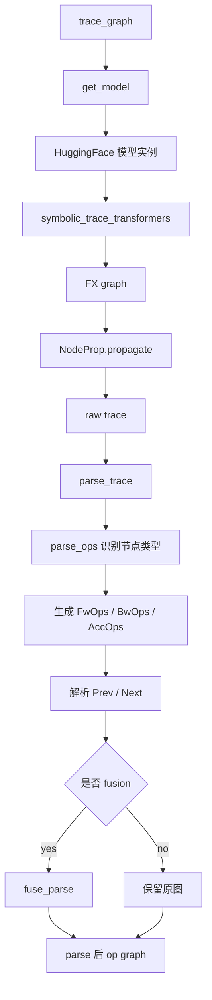
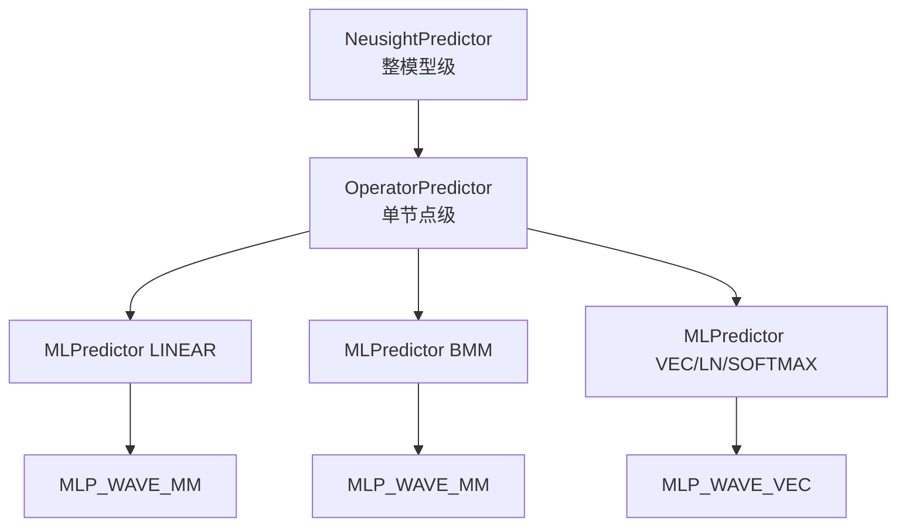
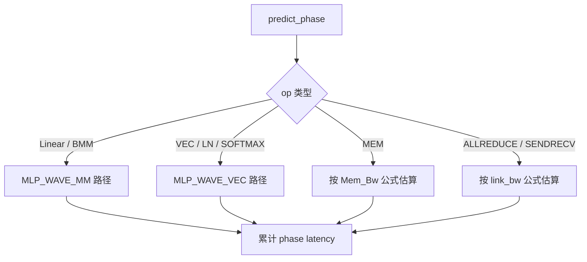
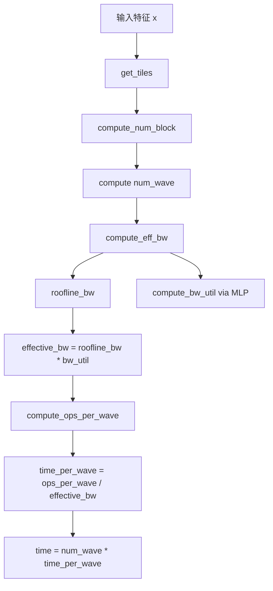
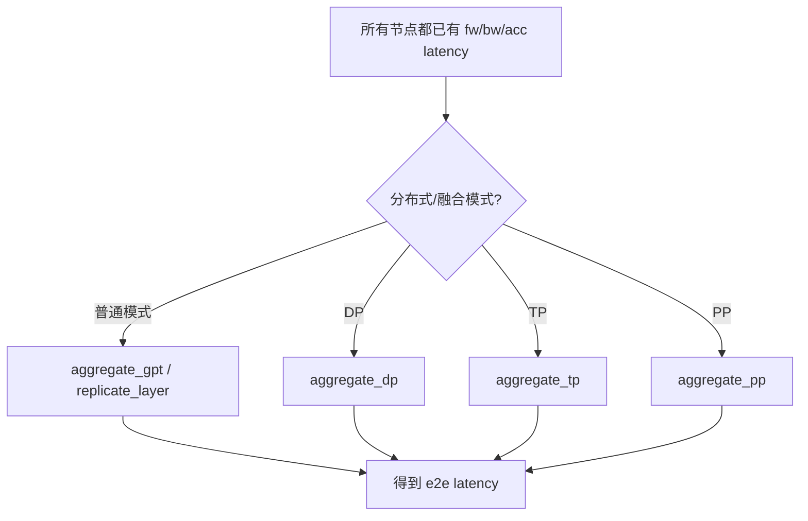

# NeuSight 代码解读与 DeepMD-kit 推理性能预测改造建议

本文档整理了对 `NeuSight` 项目的代码阅读结果，重点解释：

- 这个项目整体在做什么
- 各个核心模块分别负责什么
- 真正的核心代码在哪里
- 如果希望把它改造成：**在通用 GPU 上，对给定数量和种类的原子，用 DeepMD-kit 模型跑推理时做性能预测**，应该怎么修改

数据集相关部分会相对简略，重点放在预测主链路和可改造点上。

---

## 1. 项目整体在做什么

根据 `README.md`，NeuSight 是一个用于预测深度学习**训练和推理性能**的框架，目标是预测模型在不同 GPU 上的 latency。

核心说明见：

- `README.md`
- `scripts/pred.py`
- `scripts/train.py`

它的整体思路不是直接“把整个模型喂给一个黑盒预测器”，而是采用如下链路：

1. **Tracing**：先把模型追踪成图
2. **Parsing**：把图里的节点翻译成 NeuSight 自己定义的算子类型
3. **Operator-level Prediction**：对每个算子分别预测 latency
4. **Aggregation**：把各个算子的预测结果聚合成端到端 latency

也就是说，NeuSight 的本质是一个：

> **算子级 GPU 性能预测框架**

而不是一个直接对整网做 end-to-end 黑盒回归的框架。

---

## 2. 项目目录结构概览

仓库中的主要代码在 `neusight/` 下：

- `neusight/Tracing/`
  - 负责模型 tracing、节点分析
- `neusight/Prediction/`
  - 负责算子级预测和整网聚合
- `neusight/Model/`
  - 负责 predictor 模型本身
- `neusight/Opgraph/`
  - 负责算子图融合
- `neusight/Dataset/`
  - 负责训练数据集处理

脚本入口主要在：

- `scripts/pred.py`
- `scripts/train.py`

如果你第一次读这个项目，建议优先看下面这些文件：

1. `neusight/Prediction/predictor.py`
2. `neusight/Tracing/parse.py`
3. `neusight/Model/mlp_wave.py`
4. `neusight/Model/mlp_wave_mm.py`
5. `neusight/Model/mlp_wave_vec.py`
6. `neusight/Tracing/trace.py`
7. `neusight/Prediction/aggregator.py`

---

## 3. 端到端执行链路

最核心的预测主链路在：

- `scripts/pred.py`
- `neusight/Prediction/predictor.py`

### 3.1 `scripts/pred.py`

这个脚本只是参数入口，它接收：

- `predictor_name`
- `predictor_path`
- `device_config_path`
- `model_config_path`
- `sequence_length`
- `batch_size`
- `execution_type`
- `tile_dataset_dir`
- `result_dir`
- `options`

然后构造：

```python
neusight.NeusightPredictor(...)
```

并调用：

```python
neusight_predictor.predict(...)
```

### 3.2 `NeusightPredictor.predict()`

真正的主流程在：

- `neusight/Prediction/predictor.py:288-454`

逻辑如下：

1. 解析执行模式
   - 是否训练/推理
   - 是否启用 fusion
   - 是否 DP / TP / PP
2. 读取 GPU 配置 JSON
3. 调用 `trace_graph()` 生成原始 operator trace
4. 调用 `parse_trace()` 将原始 trace 翻译为 NeuSight 的 op graph
5. 对 op graph 每一行调用 `OperatorPredictor.predict()`
6. 将每一行的 `fw_latency/bw_latency/acc_latency` 写回 DataFrame
7. 调用 `aggregate_latency()` 聚合为端到端延迟
8. 将结果输出为 CSV 和 JSON

所以整个项目最核心的一条主链可以写成：

```text
模型配置 + GPU 配置
    -> trace_graph()
    -> parse_trace()
    -> OperatorPredictor.predict()
    -> aggregate_latency()
    -> 输出总 latency
```

---

## 4. `neusight/__init__.py`

文件：

- `neusight/__init__.py`

作用很简单：

- 导出 `NeusightPredictor`
- 导出 `Trainer`
- 导出 `model_provider`
- 导出 Dataset 相关接口

另外这里设置了：

```python
torch.backends.cudnn.benchmark = True
torch.backends.cudnn.allow_tf32 = False
```

这说明项目在测量/预测口径上偏向稳定和一致性，而不是默认开启 TF32 去追求最大吞吐。

---

## 5. Tracing 模块：模型图是怎么来的

核心文件：

- `neusight/Tracing/trace.py`
- `neusight/Tracing/analysis.py`

### 5.1 `trace.py` 的职责

`trace.py` 负责：

- 根据模型配置构造模型
- 用 Hugging Face + PyTorch FX 对模型做 tracing
- 为图上的每个节点生成结构化信息

### 5.2 `get_model()`

文件：

- `neusight/Tracing/trace.py:115-163`

这里会读取 `model_config_path` 中的 JSON，然后使用 Hugging Face 的：

- `AutoConfig`
- `AutoModelForCausalLM`
- `AutoModelForPreTraining`
- `AutoModelForSequenceClassification`
- `AutoModelForSeq2SeqLM`

根据模型名字来构造模型。

当前显式支持的主要是：

- BERT
- GPT
- OPT
- Switch Transformer

这已经说明一个非常重要的事实：

> 当前的前端 tracing 逻辑不是通用神经网络 tracing，而是明显偏向 Hugging Face Transformer 模型。

### 5.3 `trace_fx_graph()`

文件：

- `neusight/Tracing/trace.py:165-243`

它的工作是：

1. 构造模型
2. 使用 `symbolic_trace_transformers(model)` 进行 FX tracing
3. 将 tracing 结果转换成 DataFrame
4. 用 `NodeProp` 为每个节点补上更多 meta 信息

输出的是一个 DataFrame，其中每一行对应 FX graph 里的一个 node。

### 5.4 `measure_e2e()`

文件：

- `neusight/Tracing/trace.py:245-346`

这个函数在 `bench=True` 的时候会真实执行一次模型，测：

- forward latency
- backward latency

如果是推理，只测 forward。

### 5.5 `trace_graph()`

文件：

- `neusight/Tracing/trace.py:348-386`

这是 tracing 总入口：

- `bench=True`：先测 e2e，再 trace
- `bench=False`：只 trace

---

## 6. `analysis.py`：给 traced 节点补运行时属性

文件：

- `neusight/Tracing/analysis.py`

这个文件的重点是 `NodeProp`。

### 6.1 `NodeProp`

定义位置：

- `neusight/Tracing/analysis.py:260+`

它会在图遍历过程中为每个节点补充：

- `input_shapes`
- `output_shape`
- `input_contiguous`
- `meta`

这些信息后续会被 `parse.py` 使用。

### 6.2 `run_kernel()`

定义位置：

- `neusight/Tracing/analysis.py:67-258`

这个函数会在需要 benchmark 的时候：

- 真正调用 kernel
- 测量 forward latency
- 通过 `grad_fn` 遍历 backward 过程
- 估计 backward 和 `AccumulateGrad` latency

这部分更偏向数据采集和分析，不是推理预测主流程的唯一依赖，但它解释了项目如何把“图节点”变成“带形状和性能属性的节点”。

---

## 7. `parse.py`：把 traced node 翻译成 NeuSight 自己的算子图

文件：

- `neusight/Tracing/parse.py`

这是整个项目最关键的文件之一。

### 7.1 核心思想

FX trace 得到的是 PyTorch/Hugging Face 语义层面的节点，NeuSight 不能直接拿这些节点做预测，所以需要把它们翻译成更抽象的算子语言，比如：

- `Linear`
- `BMM`
- `VECadd`
- `VECmul`
- `VECln`
- `VECsoftmax`
- `MEM`
- `ALLREDUCE`
- `SENDRECV`

### 7.2 `parse_ops()`

文件：

- `neusight/Tracing/parse.py:19-259`

这个函数通过节点名字和 metadata 识别操作类型，然后生成：

- `FwOps`
- `BwOps`
- `AccOps`

例如：

#### Linear

会被拆成：

- forward 一个 `Linear`
- backward 两个 `Linear`
- 参数累加若干 `VECadd`

#### BMM / Matmul

会被翻译成 `BMM`

#### 各种逐元素操作

例如：

- add
- mul
- div
- pow
- tanh
- gelu
- relu

这些会被映射到不同的 `VECxxx`

#### LayerNorm / Softmax

分别映射到：

- `VECln`
- `VECsoftmax`

#### 内存类操作

像：

- embedding
- contiguous
- where
- dropout

很多会被简化成 `MEM`

### 7.3 `parse_trace()`

文件：

- `neusight/Tracing/parse.py:269+`

它的工作是：

1. 读取 trace CSV
2. 对每一行调用 `parse_ops()`
3. 解析依赖关系 `Prev` 和 `Next`
4. 可选调用 `fuse_parse()` 做融合
5. 可选插入 distributed 通信操作

最后输出的 DataFrame 列基本是：

- `Name`
- `OpName`
- `FwOps`
- `BwOps`
- `AccOps`
- `Prev`
- `Next`
- `InputShapes`
- `OutputShape`

这已经是 NeuSight 的“内部统一算子图表示”。

### 7.4 这部分为什么重要

因为 NeuSight 真正预测的不是原始 FX 节点，而是这里定义的抽象 op。

换句话说：

> `parse.py` 决定了 NeuSight “看见的世界是什么样子的”。

如果一个模型里的关键 kernel 在这里没被正确抽象，后面的 predictor 再强也没法预测准确。

---

## 8. `Opgraph/fuse.py`：融合相邻小算子

文件：

- `neusight/Opgraph/fuse.py`

这里定义了：

- `Node`
- `OpGraph`

它会把 parse 之后的 DataFrame 重新构造成图结构。

### 8.1 `fuse()`

文件：

- `neusight/Opgraph/fuse.py:97-114`

融合规则大致是：

- 当前节点只有一个后继
- 当前节点和后继节点都属于 vec/mem/fused/misc 这类轻量算子

则把它们融合成一个 `fused` 节点。

这能减少很多碎片化的小节点，提升预测稳定性。

---

## 9. Prediction 模块：算子 latency 是怎么预测出来的

核心文件：

- `neusight/Prediction/predictor.py`

这是预测流程的绝对核心文件之一。

### 9.1 `MLPredictor`

文件：

- `neusight/Prediction/predictor.py:44-78`

它的职责是包装一个已经训练好的 predictor：

1. 读取 `config.json`
2. 用 `model_provider()` 创建模型
3. 读取 `model.pth`
4. 如有需要，加载 meta table

`predict()` 的步骤：

1. 将 kernel 参数和 device 参数拼接成特征字典
2. 按 `self.model.features` 排列成输入向量
3. 喂给模型
4. 输出 latency

### 9.2 `OperatorPredictor`

文件：

- `neusight/Prediction/predictor.py:80-268`

它维护了多个具体 predictor：

- `LINEAR`
- `BMM`
- `VEC`
- `SOFTMAX`
- `LN`

#### `predict_phase()`

这个函数会遍历某个 phase 中的 op 列表，并做分发：

- `Linear` -> linear predictor
- `BMM` -> bmm predictor
- `VECxxx` -> vec / ln / softmax predictor
- `MEM` -> 直接按 memory bandwidth 估算
- `ALLREDUCE/SENDRECV` -> 直接按链路带宽估算

所以当前 NeuSight 内置真正支持的算子类，主要就是这些。

### 9.3 `predict()`

文件：

- `neusight/Prediction/predictor.py:232-268`

这是对一行 parse 结果进行预测的地方。

它会分别预测：

- `fw_latency`
- `bw_latency`
- `acc_latency`

并最终返回三列值。

### 9.4 `NeusightPredictor`

文件：

- `neusight/Prediction/predictor.py:270-454`

这是整个项目的总预测入口，负责：

- tracing
- parsing
- per-op 预测
- 聚合
- 写结果文件

如果你只想找“主程序在哪里”，这个类就是答案。

---

## 10. `aggregator.py`：怎么把每个节点的结果变成整网 latency

文件：

- `neusight/Prediction/aggregator.py`

### 10.1 `replicate_layer()`

文件：

- `neusight/Prediction/aggregator.py:4-38`

这个函数很关键。它通过匹配固定节点名，找到一层 Transformer block 在 trace 中的起止位置，然后复制这段 trace 多次。

它支持的模型类型主要有：

- BERT
- GPT
- OPT
- Switch

这说明聚合器并不是一个真正通用的计算图调度器，而更像一个：

> **Transformer 层复制聚合器**

### 10.2 `aggregate_gpt()`

文件：

- `aggregator.py:40-49`

简单求和：

- `e2e_latency`
- `fw_latency`
- `bw_latency`
- `bwall_latency`
- `acc_latency`

### 10.3 `aggregate_dp() / aggregate_tp() / aggregate_pp()`

文件：

- `aggregator.py:51-150`

这些函数分别处理：

- Data Parallel
- Tensor Parallel
- Pipeline Parallel

也就是说，当前 aggregator 明显是围绕 Transformer 训练/推理场景设计的。

---

## 11. Model 模块：真正的 predictor 模型

核心文件：

- `neusight/Model/model_provider.py`
- `neusight/Model/model.py`
- `neusight/Model/mlp_wave.py`
- `neusight/Model/mlp_wave_mm.py`
- `neusight/Model/mlp_wave_vec.py`

### 11.1 `model_provider.py`

这个文件是 predictor 注册中心。

当前主要注册：

- `MLP_WAVE_VEC`
- `MLP_WAVE_MM`

以及一些 baseline：

- `HABITAT_*`
- `ROOFLINE_*`
- `MICRO_*`
- `HEURISTIC_*`

核心函数：

```python
model_provider(config_path, tag=None, device=None)
```

它根据 `config["architecture"]` 构造具体 predictor。

### 11.2 `model.py`

这里定义了统一基类 `ModelBase`，主要负责：

- 保存 config
- 保存 features
- 提供 `save_state/load_state`

业务逻辑不重，但统一了模型接口。

---

## 12. `mlp_wave.py`：NeuSight 的方法论核心

文件：

- `neusight/Model/mlp_wave.py`

这是整个项目最值得重点理解的文件。

### 12.1 核心思想

NeuSight 不是直接回归 latency，而是把 latency 分解成：

1. **有效带宽（effective bandwidth）**
2. **wave 数量**
3. **每个 wave 的时间**

大致形式是：

```text
time = num_wave * time_per_wave
time_per_wave = ops_per_wave / effective_bandwidth
effective_bandwidth = roofline_bandwidth * utilization
```

### 12.2 关键函数

#### `compute_eff_bw()`

- 用设备算力和算术强度计算 roofline 上界
- 再结合 learned utilization 得到 effective bandwidth

#### `compute_bw_util()`

- 用一个 MLP 预测 bandwidth utilization

#### `compute_wave_time()`

- 结合 tile 和 SM 数量计算 wave 数
- 再计算每个 wave 的执行时间

#### `forward()`

- 整合以上步骤，输出最终预测时间

### 12.3 为什么它是核心

如果问 NeuSight 的“核心算法”是什么，不是 tracing，也不是 parse，而是：

> **Roofline + Learned Bandwidth Utilization + Wave Quantization**

这就是它的建模内核。

---

## 13. `mlp_wave_mm.py`：矩阵类算子 predictor

文件：

- `neusight/Model/mlp_wave_mm.py`

这个类适用于：

- `Linear`
- `BMM`
- 其他 GEMM 风格算子

输入特征主要是：

- `B`
- `M`
- `N`
- `K`
- `Num_Sm`
- `SingleFLOPs`
- `Dev_Mem`
- `Mem_Bw`
- `L2Cache`

关键函数包括：

- `get_tiles()`
- `compute_num_block()`
- `compute_ops_per_wave()`
- `compute_tile_ops()`
- `compute_tile_mem()`
- `comptue_op_arithinten()`

这部分负责把 mm/bmm 这种计算映射到 MLPWave 框架里。

---

## 14. `mlp_wave_vec.py`：向量类算子 predictor

文件：

- `neusight/Model/mlp_wave_vec.py`

这个类适用于：

- add/mul/div/pow
- relu/gelu/tanh
- softmax
- layer norm

输入特征主要是：

- `B`
- `H`
- `MemPerO`
- `OpsPerO`
- 以及设备特征

和 `mlp_wave_mm.py` 类似，它把向量类算子的行为映射到同一套 wave/bandwidth 框架中。

---

## 15. `meta.py`：tile 查找机制

文件：

- `neusight/Model/meta.py`

这里定义了 `MetaTable`。

作用是：

- 读取训练/采样得到的 meta table
- 对某个输入特征点，查找最接近的历史样本
- 得到对应 tile 配置

也就是说，当前 NeuSight 的 MLP_WAVE predictor 不只是纯神经网络，它还依赖：

> **经验 tile table**

这也是为什么它能更稳定地预测 mm/vec 类 kernel。

---

## 16. Dataset / Trainer 部分简述

这一部分你说可以简略，所以这里只抓主线。

### 16.1 `neusight/Dataset/dataset.py`

作用：

- 读取原始 CSV 数据
- merge GPU 配置
- 解析 tile
- 计算 `MemPerO` / `OpsPerO`
- 构造成训练样本

### 16.2 `neusight/Model/trainer.py`

作用：

- 构建 `Dataset`
- train/val split
- DataLoader
- 损失函数
- AdamW 优化
- 保存最好模型

### 16.3 `neusight/Dataset/dims.py`

作用：

- 生成训练和测试维度点
- 本质上是论文实验和训练数据准备辅助脚本

---

## 17. 当前项目的真实假设

如果把这个项目的设计假设总结出来，大致是：

1. 前端模型是 Hugging Face Transformer
2. 节点可以通过名称规则映射成有限几类算子
3. 核心算子主要是：
   - Linear
   - BMM
   - VEC
   - LN
   - Softmax
4. 聚合结构近似 Transformer block 重复
5. 通信是标准 DP/TP/PP 场景

因此它的“通用性”主要体现在：

- 可以换 GPU
- 可以换 predictor

但它的“模型前端”和“算子空间”并不完全通用。

---

## 18. 如果要用这个代码预测 DeepMD-kit 在通用 GPU 上的推理，该怎么改

这里先给结论：

> **不能直接拿现有 `trace.py + parse.py + aggregator.py` 不改就做 DeepMD。**

最合理的方式是：

> **保留 NeuSight 的后半段 predictor 思想，重写前半段 DeepMD 前端。**

也就是保留：

- 设备配置机制
- MLP_WAVE predictor
- per-op latency prediction 流程

重写：

- 模型图构造方式
- op 抽象方式
- 聚合方式

---

## 19. 为什么当前代码不能直接用于 DeepMD-kit

### 19.1 `trace.py` 强依赖 Hugging Face

文件：

- `neusight/Tracing/trace.py:115-163`

这里只会构造：

- BERT
- GPT
- OPT
- Switch Transformer

不会加载 DeepMD-kit 模型。

### 19.2 输入接口不适合 DeepMD

文件：

- `scripts/pred.py`

当前要求：

- `sequence_length`
- `batch_size`

而 DeepMD 更自然的输入应该是：

- 原子数
- 原子种类
- 邻居数统计
- 描述子维度
- embedding/fitting 网络规模

### 19.3 `parse.py` 不认识 DeepMD 的关键计算

文件：

- `neusight/Tracing/parse.py`

当前它主要识别：

- Linear
- BMM
- Softmax
- LayerNorm
- Vector ops
- Memory ops

但 DeepMD 的关键计算通常包括：

- neighbor list / pair list 构造
- gather / scatter
- pairwise distance
- descriptor 计算
- 原子局部 embedding/fitting MLP
- reduction / accumulation
- 可能还有 DeepMD 自定义 CUDA kernel

这些都没有被显式支持。

### 19.4 `aggregator.py` 强依赖 Transformer 层结构

文件：

- `neusight/Prediction/aggregator.py`

它是通过固定节点名找 Transformer layer 边界并复制层数。

DeepMD 并没有这种结构。

### 19.5 tile 数据不匹配

文件：

- `neusight/Model/meta.py`

当前 meta table 是围绕已有的 mm/vec kernel 数据构建的，DeepMD 自定义 kernel 没有现成的 tile table。

---

## 20. 面向 DeepMD-kit 的推荐改造方案

推荐分两层来做。

---

## 21. 第一阶段：做一个最小可行版本

目标：

- 先支持 **单 GPU**
- 先支持 **推理**
- 先支持 **给定原子数和种类时的 latency 近似预测**

### 21.1 新增一个 DeepMD 专用入口脚本

建议新增：

- `scripts/pred_deepmd.py`

输入改成例如：

- `--device_config_path`
- `--deepmd_model_config_path`
- `--num_atoms`
- `--atom_types`
- `--avg_neighbors`
- `--result_dir`

而不是：

- `--sequence_length`
- `--batch_size`

### 21.2 新增 DeepMD 前端图构造器

建议新增：

- `neusight/Tracing/trace_deepmd.py`

这个文件不要再用 Hugging Face FX tracing，而是直接根据 DeepMD 模型结构生成 operator graph。

如果当前目标只是性能预测，并不一定要完全依赖框架 tracing。更现实的方法是：

> 直接把 DeepMD 推理阶段抽象成一张算子图。

### 21.3 直接生成 parse 后的 DataFrame

建议新增：

- `neusight/Tracing/parse_deepmd.py`

或者更简单：

直接在 `trace_deepmd.py` 中输出 NeuSight 需要的 parse 后格式：

- `Name`
- `OpName`
- `FwOps`
- `BwOps`
- `AccOps`
- `Prev`
- `Next`
- `InputShapes`
- `OutputShape`

对于推理任务：

- `BwOps = []`
- `AccOps = []`

这样就能绕过当前专为 Transformer 写的 `parse.py`。

### 21.4 聚合方式改成简单求和

建议在：

- `neusight/Prediction/aggregator.py`

中新增一个通用聚合函数，例如：

```python
def aggregate_sum(trace):
    return trace["fw_latency"].sum()
```

对单 GPU DeepMD 推理来说，最简单有效的聚合就是：

> 把所有前向节点的 latency 相加

这样可以完全绕过当前 Transformer 专用的 `replicate_layer()`。

---

## 22. 第二阶段：定义 DeepMD 的算子抽象

为了复用现有 predictor，建议先把 DeepMD 推理分成几类阶段。

可以考虑抽象成：

1. `NEIGHBOR`
   - 邻居列表或邻接准备
2. `GATHER`
   - 基于邻接索引取邻居特征
3. `PAIRWISE`
   - 计算 pairwise descriptor / distance / environment feature
4. `MLP`
   - 原子级 embedding / fitting 网络
5. `REDUCE`
   - 邻域归约
6. `SCATTER`
   - 将 pair 信息回写到 atom 上

其中一部分可以先近似到现有算子：

- MLP -> `Linear + VECact`
- reduction -> `VECadd`
- 单纯数据搬运 -> `MEM`
- 一些批处理张量乘加 -> `BMM`

也就是说，在第一阶段可以先采用：

> **DeepMD 算子 -> NeuSight 现有算子语言** 的近似映射

这样改动最小。

---

## 23. 第三阶段：为 DeepMD 特有 kernel 增加 predictor

如果后续发现误差较大，建议新增专用 predictor。

### 23.1 需要新增的文件

例如：

- `neusight/Model/mlp_wave_gather.py`
- `neusight/Model/mlp_wave_pairwise.py`
- `neusight/Model/mlp_wave_reduce.py`

### 23.2 需要修改的文件

#### `neusight/Model/model_provider.py`

注册新的 architecture，例如：

- `MLP_WAVE_GATHER`
- `MLP_WAVE_PAIRWISE`
- `MLP_WAVE_REDUCE`

#### `neusight/Prediction/predictor.py`

在 `OperatorPredictor.predict_phase()` 中增加新的分发逻辑。

例如：

- `elif opname == "GATHER": ...`
- `elif opname == "PAIRWISE": ...`
- `elif opname == "REDUCE": ...`

### 23.3 新 predictor 的输入特征建议

可以考虑包括：

- `NumAtoms`
- `NumTypes`
- `AvgNeighbors`
- `MaxNeighbors`
- `FeatureDim`
- `HiddenDim`
- `Num_Sm`
- `SingleFLOPs`
- `Mem_Bw`
- `L2Cache`

这些比当前的 `B/M/N/K` 或 `B/H` 更适合 DeepMD。

---

## 24. 如果只想快速做一个“近似可用”的 DeepMD predictor

最务实的做法不是一开始就新增很多模型，而是：

### 24.1 先把 DeepMD 推理过程翻译成以下 op 序列

例如：

1. 邻居准备
   - `MEM`
2. 邻居 gather
   - `MEM`
3. descriptor 计算
   - `BMM` 或 `VEC`
4. embedding 网络
   - 多层 `Linear + VECgelu/relu`
5. reduction
   - `VECadd`
6. fitting 网络
   - 多层 `Linear + VECgelu/relu`
7. 输出层
   - `Linear`

### 24.2 然后直接复用当前 predictor

也就是继续使用：

- `LINEAR`
- `BMM`
- `VEC`
- `MEM`

先不引入新的 predictor。

这样做虽然是近似，但工程上最快，适合先验证：

- 趋势是否合理
- 随原子数增长是否单调
- 不同 GPU 排序是否合理

---

## 25. 推荐的具体改动清单

如果目标是：

> 在单卡通用 GPU 上，对给定数量和种类的原子，用 DeepMD-kit 模型进行推理性能预测

推荐按下面方式改代码。

### 25.1 新增文件

- `scripts/pred_deepmd.py`
- `neusight/Tracing/trace_deepmd.py`
- `neusight/Tracing/parse_deepmd.py`  
  或者把 parse 后输出直接在 `trace_deepmd.py` 里生成

### 25.2 修改文件

- `neusight/Prediction/predictor.py`
  - 增加一个“读取 DeepMD parse 结果并预测”的入口

- `neusight/Prediction/aggregator.py`
  - 增加通用 `aggregate_sum()`

### 25.3 暂时不建议改动的文件

- `neusight/Tracing/trace.py`
- `neusight/Tracing/parse.py`
- `neusight/Model/trainer.py`
- `neusight/Dataset/*`

原因是：

- 现有 Transformer 路径最好保留，避免影响原功能
- DeepMD 路径更适合作为新增分支，而不是硬塞进原有 Hugging Face tracing 流程

---

## 26. DeepMD 输入该如何抽象

如果要做一个真正可用的 DeepMD 输入配置，建议至少包含这些字段：

- `num_atoms`
- `atom_types`
- `num_types`
- `avg_neighbors`
- `max_neighbors`
- `descriptor_dim`
- `embedding_num_layers`
- `embedding_hidden_dim`
- `fitting_num_layers`
- `fitting_hidden_dim`

如果以后要进一步提高准确率，还可以加入：

- cutoff radius
- 邻居列表稀疏度
- 原子类型分布
- 是否输出 force / virial

因为 DeepMD 的实际推理成本不只是看原子数，还强烈依赖：

- 每个原子的邻居规模
- 描述子计算复杂度
- 类型嵌入与网络规模

---

## 27. 我对这个项目的最终判断

### 27.1 可以直接复用的部分

- 设备配置 JSON 机制
- per-op latency prediction 框架
- `MLPWave` 的建模思想
- `OperatorPredictor` 的组织方式

### 27.2 不适合直接复用的部分

- Hugging Face / Transformer tracing 前端
- 名字驱动的 Transformer parse 规则
- Transformer 层复制聚合器
- 现有算子空间对 DeepMD 的覆盖

### 27.3 最合理的改造思路

不是“把 DeepMD 硬塞进现有 Transformer tracing 流程”，而是：

> **保留 NeuSight 后端预测框架，新增 DeepMD 前端和必要的 DeepMD 算子抽象。**

这是最稳、也最容易逐步验证准确性的路线。

---

## 28. 一句话总结

NeuSight 当前本质上是一个：

> **针对 Transformer 场景优化过的算子级 GPU latency predictor**

如果你要拿它来预测：

> **DeepMD-kit 在通用 GPU 上、给定原子数和原子种类时的推理性能**

最建议的路线是：

1. 保留现有 predictor 后端
2. 新增 DeepMD 专用输入接口
3. 新增 DeepMD 的 operator graph 构造逻辑
4. 单卡推理先用简单求和聚合
5. 后续再对误差大的 DeepMD 特有 kernel 增加专用 predictor

---

## 29. 后续如果继续开发，建议优先做什么

建议的实现优先级：

1. 新增 `pred_deepmd.py`
2. 新增 `trace_deepmd.py`
3. 生成单卡推理 parse 后 op graph
4. 复用现有 `LINEAR/BMM/VEC/MEM` predictor 跑通第一版
5. 评估误差
6. 只对误差大的 DeepMD 专有算子新增 predictor

这样可以最快得到一个可工作的版本。

---

## 30. 用流程图梳理 NeuSight 代码主线

如果你在写整理文档，建议不要再贴太多代码片段，而是把主逻辑改成下面这种“流程图 + 文字解释”的方式。这样更容易讲清楚：

- 谁是入口
- 数据怎么流动
- 哪一层负责哪一层
- 哪些地方是 Transformer 特化

下面这些 Mermaid 流程图可以直接放进 Markdown 文档中使用。

### 30.1 全局总流程图：从输入到最终 latency



这张图适合放在文档最前面，用来说明 NeuSight 不是一个黑盒模型，而是一条完整流水线。

---

### 30.2 模块职责图：各目录分别干什么



可以配套说明：

- `Tracing/`：拿到原始模型图
- `Parse/`：把图翻译成 NeuSight 内部算子表示
- `Prediction/`：执行逐节点预测和整图聚合
- `Model/`：真正的 predictor 模型实现
- `Dataset/`：训练 predictor 时使用的数据支撑

---

### 30.3 `trace + parse` 主线图：模型图如何变成 NeuSight 的 op graph



这张图建议用来说明两件事：

- `trace.py` 负责把模型变成 raw trace
- `parse.py` 负责把 raw trace 变成 NeuSight 内部 op graph

也就是：

> `trace` 解决“图从哪里来”，`parse` 解决“图怎样变成可预测的算子图”。

---

### 30.4 predictor 层级图：三层 predictor 分别负责什么



这张图配套可以直接写成：

- `NeusightPredictor`：负责整模型流程
- `OperatorPredictor`：负责单节点 `fw/bw/acc` 预测
- `MLPredictor`：负责单个底层算子的实际预测调用
- `MLP_WAVE_MM / VEC`：负责真正计算 latency

---

### 30.5 单节点预测图：一个节点如何变成三类 latency

```mermaid
flowchart TD
    A[一行 parse 后节点] --> B[读取 FwOps / BwOps / AccOps]
    B --> C[predict_phase(FwOps)]
    B --> D[predict_phase(BwOps)]
    B --> E[predict_phase(AccOps)]
    C --> F[fw_latency]
    D --> G[bw_latency]
    E --> H[acc_latency]
    F --> I[节点总输出]
    G --> I
    H --> I
```

这张图最适合说明：

- 为什么一个节点会拆成三类 latency
- `OperatorPredictor.predict()` 的粒度是**单节点**
- 节点不是直接等于一个 kernel，而是一个语义节点对应的一组底层 op

---

### 30.6 `predict_phase()` 简化分发图：底层 op 如何路由到具体模型



这张图很适合解释：

- 为什么 `OperatorPredictor` 是“调度器”
- 为什么 `mlp_wave_mm.py` 和 `mlp_wave_vec.py` 是底层模型实现

---

### 30.7 `MLP_WAVE` 内部计算逻辑图



这张图可以用来突出：

> NeuSight 的算法核心不是 tracing，而是 `MLP_WAVE` 里的 wave + roofline + utilization 建模。

---

### 30.8 聚合流程图：为什么最后还需要 `aggregate_latency()`



这张图可以配套强调一句：

> 当前 `aggregator.py` 不是通用聚合器，而是明显带 Transformer 层复制假设的聚合器。

---

### 30.9 推荐保留的最小图集

如果你只想保留最关键的图，建议文档中最终只留这 6 张：

1. **全局总流程图**
2. **模块职责图**
3. **`trace + parse` 主线图**
4. **predictor 层级图**
5. **`MLP_WAVE` 内部计算逻辑图**
6. **聚合流程图**

这样既能讲清楚主线，也不会显得图太碎。

---

### 30.10 适合直接放进你文档里的总结模板

如果你想把“代码解析”写得更像说明文，而不是代码摘抄，建议每个模块都按下面格式写：

1. **模块输入是什么**
2. **模块输出是什么**
3. **模块内部关键步骤是什么**
4. **它和上下游模块的关系是什么**
5. **它的局限性是什么**

例如可以这样写：

- `trace.py`：负责把 Hugging Face 模型转换成 raw trace，是 NeuSight 的前端图构造模块
- `parse.py`：负责把 raw trace 翻译成 NeuSight 内部算子图，是 tracing 和 predictor 之间的桥梁
- `OperatorPredictor`：负责对单节点中的 `FwOps/BwOps/AccOps` 做逐类分发和预测，是节点级调度器
- `mlp_wave_mm.py` / `mlp_wave_vec.py`：负责真正执行底层算子 latency 预测，是 predictor 的算法实现层
- `aggregator.py`：负责从逐节点预测结果得到整网 latency，是整图级后处理模块

这样写出来会比大量贴代码更清楚。

---

## 31. 用“workflow + 关键代码片段”来讲代码

如果你希望文档既有流程图，又保留最必要的代码证据，推荐采用下面这种写法：

- 先说明这一阶段在 workflow 里做什么
- 再给一个最小必要代码片段
- 最后解释这段代码在整条链路中的位置

这样既不会变成大段贴代码，也不会显得太空。

---

### 31.1 入口阶段：脚本如何启动预测

#### workflow 说明

最外层入口在 `scripts/pred.py`。它的职责不是做预测计算，而是：

1. 读取命令行参数
2. 构造 `NeusightPredictor`
3. 调用 `predict()`

#### 关键代码片段

```python
# scripts/pred.py
neusight_predictor = neusight.NeusightPredictor(
    predictor_name=args.predictor_name,
    predictor_path=args.predictor_path,
    tile_dataset_dir=args.tile_dataset_dir,
)

neusight_predictor.predict(
    device_config_path=args.device_config_path,
    model_config_path=args.model_config_path,
    sequence_length=args.sequence_length,
    batch_size=args.batch_size,
    execution_type=args.execution_type,
    result_dir=args.result_dir,
    options=args.options,
)
```

#### 这段代码说明了什么

这说明 `scripts/pred.py` 只是一个壳，真正的核心逻辑都在：

- `neusight/Prediction/predictor.py`

也就是说：

> 命令行脚本只负责“启动”，不负责“预测算法本身”。

---

### 31.2 总控阶段：整模型预测主线

#### workflow 说明

真正的总流程在 `NeusightPredictor.predict()` 中，顺序是：

1. trace 原始图
2. parse 成 op graph
3. 对每一行节点做 latency prediction
4. 聚合成总 latency

#### 关键代码片段

```python
# neusight/Prediction/predictor.py
df, _ = trace_graph(...)
dump_df(df, trace_name)

df = parse_trace(...)
dump_df(df, parse_name)

df = pd.read_csv(parse_name, converters={...})
df[["fw_latency", "bw_latency", "acc_latency"]] = \
    df.apply(lambda x: self.predictor.predict(device_config, x), axis=1)

df["bwall_latency"] = df["bw_latency"] + df["acc_latency"]
df["e2e_latency"] = df["fw_latency"] + df["bw_latency"] + df["acc_latency"]

e2e, fw, bw, bwall, acc = aggregate_latency(...)
```

#### 这段代码说明了什么

这段代码就是 NeuSight 的总主线，直接对应这条 workflow：

```text
trace_graph -> parse_trace -> OperatorPredictor.predict -> aggregate_latency
```

这也是整个项目最值得先记住的一条主路径。

---

### 31.3 tracing 阶段：模型图从哪里来

#### workflow 说明

`trace_graph()` 负责产生 raw trace，它内部会进一步调用：

- `get_model()`
- `trace_fx_graph()`
- `NodeProp.propagate()`

#### 关键代码片段

```python
# neusight/Tracing/trace.py
model, n_layer = get_model(
    model_config_path=tmp_fname,
    is_train=is_train,
    device=device,
    fusion=False
)

graphmodule: torch.fx.GraphModule = symbolic_trace_transformers(model)

nodeprop = NodeProp(graphmodule)
graphmodule = nodeprop.propagate(*inputs, backward=is_train, bench=bench)
```

#### 这段代码说明了什么

这说明 tracing 前端是建立在：

- Hugging Face 模型构造
- Transformer FX tracing

之上的。

所以这一段最适合配合流程图说明：

> 当前 `trace.py` 不是通用模型 tracing，而是 Transformer/HuggingFace 特化前端。

---

### 31.4 parsing 阶段：节点如何翻译成 NeuSight 算子

#### workflow 说明

`parse_trace()` 会对 raw trace 的每一行调用 `parse_ops()`，把一个 traced node 翻译成：

- `FwOps`
- `BwOps`
- `AccOps`

#### 关键代码片段

```python
# neusight/Tracing/parse.py
df[["OpName", "FwOps", "BwOps", "AccOps"]] = df.apply(
    lambda x: parse_ops(
        x.iloc[columns.index("Name")],
        x.iloc[columns.index("input_shapes")],
        x.iloc[columns.index("output_shape")],
        x.iloc[columns.index("meta")],
        vocab_size,
        x.iloc[columns.index("input_contiguous")],
        is_train
    ),
    axis=1
)
```

#### 典型规则代码片段

```python
# neusight/Tracing/parse.py
elif ("addmm" in name) or ("nn.modules.linear.Linear" in meta):
    opname = "Linear"
    fw_ops.append(("Linear", (B, I, O)))
    bw_ops.append(("Linear", (B, O, I)))
    bw_ops.append(("Linear", (O, B, I)))
    acc_ops.append(("VECadd", [1, O*I]))
    acc_ops.append(("VECadd", [1, O]))
```

#### 这段代码说明了什么

这说明 NeuSight 不会把一个节点直接当成一个 kernel，而是：

> 把一个语义节点翻译成一组更底层的算子账本。

这也是为什么后面一个节点会有三类 latency。

---

### 31.5 单节点预测阶段：`OperatorPredictor` 在做什么

#### workflow 说明

`OperatorPredictor.predict()` 的输入不是整模型，而是 parse 后 DataFrame 的**一行**。  
它会分别计算：

- `FwOps` 对应的 `fw_latency`
- `BwOps` 对应的 `bw_latency`
- `AccOps` 对应的 `acc_latency`

#### 关键代码片段

```python
# neusight/Prediction/predictor.py
fw_latency = self.predict_phase(
    device_config=device_config,
    input_shapes=input_shapes,
    output_shape=output_shape,
    ops=fw_ops,
    opname=opname
)
bw_latency = self.predict_phase(...)
acc_latency = self.predict_phase(...)

return pd.Series([fw_latency * 1000, bw_latency * 1000, acc_latency * 1000])
```

#### 这段代码说明了什么

这说明 `OperatorPredictor` 是一个**单节点级调度器**，不是整模型 predictor。

你可以直接在文档里配一句：

> `OperatorPredictor.predict()` 处理的是“一行节点”，不是“整张图”。

---

### 31.6 分发阶段：底层 op 是怎么路由到不同模型的

#### workflow 说明

在 `predict_phase()` 中，系统会根据 op 类型，把请求发给不同 predictor，或者直接用公式估算。

#### 关键代码片段

```python
# neusight/Prediction/predictor.py
if opname == "Linear":
    latency += self.linear_predictor.predict(...)

elif opname == "BMM":
    latency += self.bmm_predictor.predict(...)

elif opname.startswith("VEC"):
    latency += self.vec_predictor.predict(...)

elif opname == "MEM":
    latency += mem / (self.mem_bw * (2**30))
```

#### 这段代码说明了什么

这说明：

- `OperatorPredictor` 只负责**路由与累加**
- 真正的 MM/VEC latency 计算，在更底层的 model 里

也就是：

> `predictor.py` 负责调度，`mlp_wave_mm.py / mlp_wave_vec.py` 负责真正计算。

---

### 31.7 底层模型阶段：`mlp_wave_mm.py` 和 `mlp_wave_vec.py` 在做什么

#### workflow 说明

这两个文件是被 `MLPredictor -> model_provider -> MLP_WAVE_*` 这一条链最终调用到的底层实现。

- `mlp_wave_mm.py`：处理 `Linear / BMM`
- `mlp_wave_vec.py`：处理 `VEC / LN / SOFTMAX`

#### 关键代码片段

```python
# neusight/Model/model_provider.py
from .mlp_wave_vec import MLPWaveVec
constructor["MLP_WAVE_VEC"] = MLPWaveVec

from .mlp_wave_mm import MLPWaveMM
constructor["MLP_WAVE_MM"] = MLPWaveMM
```

```python
# neusight/Model/mlp_wave.py
tiles = self.get_tiles(x=x, tiles=tiles, culib=culib, opname=opname)
num_wave, time_per_wave = self.compute_wave_time(opname=opname, x=x, tiles=tiles)
time = num_wave * time_per_wave
```

#### 这段代码说明了什么

这说明真正的 latency 计算逻辑不是写在 `predictor.py` 里，而是在：

- `MLP_WAVE`
- `MLP_WAVE_MM`
- `MLP_WAVE_VEC`

这一层。

也就是说：

> `predictor.py` 像“调度层”，`mlp_wave*.py` 像“算法层”。

---

### 31.8 聚合阶段：为什么最后还要 `aggregate_latency()`

#### workflow 说明

在所有节点都已经有了：

- `fw_latency`
- `bw_latency`
- `acc_latency`

之后，系统才进入最终聚合阶段。

#### 关键代码片段

```python
# neusight/Prediction/aggregator.py
def aggregate_latency(df, model_name, distributed, dp_degree, pp_degree, pp_num_microbatch, tp_degree, fusion, n_layer):
    if distributed:
        ...
    elif fusion:
        e2e, fw, bw, bwall, acc = aggregate_gpt(df, model_name, 0)
    else:
        e2e, fw, bw, bwall, acc = aggregate_gpt(df, model_name, n_layer)
    return e2e, fw, bw, bwall, acc
```

#### 这段代码说明了什么

这说明 `aggregate_latency()` 并不是简单求和，它还夹带了：

- Transformer 层复制
- DP / TP / PP 假设

所以这也是后续 DeepMD 改造时最需要注意的部分之一。

---

### 31.9 推荐写法：一图一段代码一段解释

如果你后面继续整理文档，我建议每个模块都用下面的结构：

1. **一张流程图**
2. **一段最小必要代码**
3. **一段解释：这段代码在整条 workflow 中处于哪里**

例如：

- 图：`trace + parse` 主线图
- 代码：`trace_graph(...)` + `parse_trace(...)`
- 解释：说明从模型图到 op graph 的转换过程

这种写法会比“只贴代码”更清楚，也比“只有图没有代码”更有依据。
