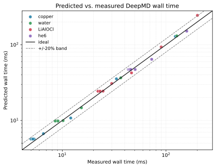
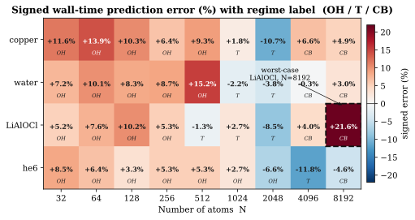
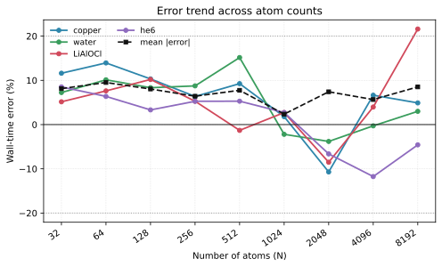
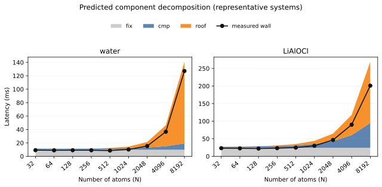

# 基于 NeuSight 的 DeepMD-kit 推理性能预测器项目报告

**项目名称：** 面向 DeepMD-kit 的端到端推理性能预测器研究与实现  
**项目目录：** `NeuSight_MD`  
**报告日期：** 2026 年 5 月 30 日  
**报告版本：** Final Report v3  
**当前有效模型：** v6 + P0a/P0b/P2 + 修法 A  
**适用范围：** 课题组内部汇报、导师审阅、阶段性项目总结

---

## 摘要

本项目围绕 DeepMD-kit 分子动力学神经势模型的推理性能预测问题，基于 NeuSight GPU 性能预测框架进行了面向 DeepMD-kit 的系统性改造。NeuSight 原始版本主要服务 Transformer 类深度学习模型，依赖 HuggingFace / FX tracing 自动抽取计算图，并通过 `MLP_WAVE` 模型预测 Linear、BMM、elementwise 等标准算子的 GPU 执行时间。DeepMD-kit 的 PyTorch 推理路径与 Transformer 有显著差异，包含 neighbor list 构建、environment matrix 生成、按原子类型展开的 embedding network、descriptor 矩阵运算、fitting network 以及 force backward 等过程，无法直接套用原始 NeuSight 前端。

本项目的核心工作是：保留 NeuSight 已训练的算子级预测器，重写 DeepMD-kit 专用解析前端，并构建面向 DeepMD 推理特点的端到端开销模型。最终系统能够从 DeepMD 配置文件出发，静态生成 NeuSight 兼容的算子图，预测可见神经网络算子延迟，并通过 fixed overhead、未建模 GPU roofline 项和 transition bubble 项补齐 NeuSight 无法覆盖的系统开销。

在 NVIDIA H100 NVL 单卡环境下，当前版本针对 4 个 `se_e2_a` 体系（copper、water、LiAlOCl、he6）和 9 个原子数规模（N=32 到 8192）进行了 36 个测量点验证。以最终保守口径统计，端到端 wall-time 预测达到 **MAE 7.1%、RMSE 8.3%**；其中 N≤4096 的 32 个测量点全部落在 ±20% 误差范围内。结果表明，当前系统已经能够作为 H100 上 `se_e2_a` DeepMD 模型的端到端推理延迟估计工具，用于实验规模预估、模型配置比较和资源规划。

同时，本项目也明确识别出当前模型的主要不足：`cmp` 部分仍受 NeuSight 原始 `MLP_WAVE` 训练分布限制，对 DeepMD 特有的极端 Linear/BMM shape 存在系统性低估。当前 wall-time 结果可用，但阶段级拆分，尤其是 `cmp` 与 `roof` 的独立解释，还不能直接作为 kernel 级优化建议。这个问题是后续继续改进本项目的核心方向。

**关键词：** DeepMD-kit；NeuSight；GPU 性能预测；分子动力学；推理延迟；kernel launch；roofline；pipeline bubble；模型校准

---

## 1. 项目背景

### 1.1 DeepMD-kit 推理性能预测的需求

DeepMD-kit 是分子动力学和科学机器学习中常用的神经势模型框架。在实际模拟任务中，模型结构、原子数规模、邻居数设置、描述子类型以及硬件平台都会显著影响推理延迟。对于大规模模拟任务而言，推理性能直接决定生产任务吞吐和资源消耗。因此，在正式运行昂贵 benchmark 或长时间分子动力学模拟之前，若能对 DeepMD-kit 模型的端到端推理延迟进行快速预测，将具有实际工程价值。

DeepMD-kit 的推理耗时并不只由神经网络层的矩阵乘决定。对于小原子数，数百个 CUDA kernel launch、Python/PyTorch 调度和 autograd 元数据开销会形成明显平台期；对于较大原子数，neighbor list、environment matrix、descriptor 构造和随机访存逐渐成为主要开销；在中等原子数区域，CPU launch chain 与 GPU compute pipeline 接近同一量级，会出现 transition bubble。这些现象使得简单的 FLOPs 估算、单纯神经网络算子预测或经验幂律拟合都难以稳定覆盖完整范围。

### 1.2 NeuSight 的基础能力与局限

NeuSight 是一个面向深度学习训练和推理的 GPU 性能预测框架。其核心能力是利用已训练的 `MLP_WAVE` 算子级模型预测标准算子的 GPU 执行时间，例如 Linear、BMM、激活函数和 elementwise 操作。原始 NeuSight 的输入流程主要围绕 Transformer 模型设计：通过 HuggingFace / FX tracing 获取计算图，再对图中算子逐项预测并聚合。

这一设计无法直接应用于 DeepMD-kit，原因包括：

1. DeepMD-kit 不是 Transformer 结构，无法自然走 HuggingFace tracing 路径。
2. DeepMD 推理中包含 neighbor list、topk、gather、scatter、environment matrix 等大量非标准神经网络操作。
3. DeepMD 的 embedding network 与原子类型、邻居类型密切相关，尤其 `type_one_side=False` 时会出现 `ntypes^2` 规模的子网络展开。
4. Force 计算依赖 autograd backward，其 kernel 组成和 forward MLP 不完全一致。
5. 小 N 下端到端延迟主要由 CPU/kernel launch 固定开销决定，而 NeuSight 原始模型只预测 GPU 算子执行时间。

因此，本项目不是简单调用 NeuSight，而是对 NeuSight 的前端和端到端开销建模进行面向 DeepMD-kit 的专门改造。

---

## 2. 项目目标与工作范围

### 2.1 项目目标

本项目的总体目标是构建一个 DeepMD-kit 推理性能预测器，使其能够在不实际运行完整 DeepMD 推理 benchmark 的情况下，基于模型配置、原子数和 GPU 信息预测端到端 wall-time。

具体目标包括：

1. 分析 DeepMD-kit PyTorch 后端推理路径，建立可静态解析的计算阶段划分。
2. 将 DeepMD 推理过程转换为 NeuSight 可识别的算子图，使 `MLP_WAVE` 能参与预测。
3. 建立 NeuSight 无法覆盖部分的 overhead model，包括固定调度开销、未建模 GPU 访存项和 transition bubble。
4. 在 H100 GPU 上完成多体系、多原子数的实测验证，明确模型精度和适用边界。
5. 整理项目版本演进、实验结果、局限性和后续研究方向，形成可用于导师汇报的阶段性项目报告。

### 2.2 当前工作范围

当前最终报告的结论主要覆盖以下范围：

| 维度 | 当前范围 |
|---|---|
| 硬件 | NVIDIA H100 NVL，单卡评估 |
| 软件后端 | DeepMD-kit 3.x PyTorch 后端 |
| 主要描述子 | `se_e2_a` |
| 推理路径 | `compute_force=True`，即 energy forward + force backward |
| 验证体系 | copper、water、LiAlOCl、he6 |
| 原子数范围 | N=32, 64, 128, 256, 512, 1024, 2048, 4096, 8192 |
| 主评价指标 | 端到端 wall-time 误差 |

以下范围不作为当前最终精度承诺：

- DPA-1 / DPA-2 / attention descriptor；
- 未经重新校准的跨 GPU 预测；
- N>8192 的真实测量与外推；
- 压缩 `.pb` lookup-table 推理路径；
- kernel 级或阶段级精确瓶颈诊断。

---

## 3. 技术路线

### 3.1 总体方案

项目采用“NeuSight 后端复用 + DeepMD 前端重写 + 端到端 overhead 补偿”的技术路线。

原始 NeuSight 流程为：

```text
HuggingFace 模型 -> FX tracing -> Transformer op graph -> MLP_WAVE -> latency aggregation
```

本项目改造后的流程为：

```text
DeepMD config / input.json
    -> DeepMD 配置解析
    -> DeepMD 静态算子图构造
    -> NeuSight MLP_WAVE 逐算子预测
    -> DeepMD latency aggregation
    -> fixed / roof / bubble overhead model
    -> wall-time prediction + regime + confidence
```

这种方案的优点是边界清晰：NeuSight 已有算子预测能力被保留，DeepMD 专有结构由新前端解析，系统级开销由独立模型处理。这样既避免了重新训练完整预测器，也避免把 DeepMD 特有的 neighbor-list 和 kernel-launch 现象强行映射成普通深度学习算子。

### 3.2 DeepMD 推理阶段划分

根据 DeepMD-kit PyTorch 后端源码，`se_e2_a` 推理路径被划分为七个阶段：

| 阶段 | 主要内容 | 当前处理方式 |
|---|---|---|
| 1. Neighbor List | ghost atom 扩展、距离计算、topk 邻居选择 | 大部分进入 roofline；最终 gather 用 MEM 近似 |
| 2. Environment Matrix | gather 邻居坐标，计算 `1/r`、方向项和平滑函数 | MEM + VEC 近似，未覆盖部分进入 roofline |
| 3. Embedding Network | 对邻居距离特征执行 per-type 或 per-pair MLP | Linear + VECtanh + residual，按 `type_one_side` 展开 |
| 4. Descriptor BMM | embedding 输出与环境矩阵做 descriptor 矩阵运算 | BMM + MEM |
| 5. Fitting Network | 对每个原子的 descriptor 做 MLP | Linear + activation + residual |
| 6. Output | 输出 per-atom energy 并求和 | Linear + reduction |
| 7. Force Backward | autograd 反向传播得到 force | backward Linear/BMM/MEM 近似 |

项目中特别处理了三个关键结构问题。

第一，embedding network 必须按原子类型或类型对展开。对于 water，`sel=[46, 92]`，两个邻居类型对应不同 batch 规模的 embedding 子网络；对于 `type_one_side=False` 的多元素体系，则需要按中心类型和邻居类型组合展开，规模接近 `ntypes^2`。这一点直接影响 kernel 数和 fixed overhead。

第二，force backward 不能只用一个反向 Linear 表示。修法 A 中，每个 backward Linear 被拆成 `grad_input`、`grad_weight` 和 `grad_bias` 三个子操作，使 opgraph 更贴近 PyTorch autograd 的实际 kernel 结构。

第三，neighbor list 和 environment matrix 的主体开销没有被 NeuSight 原始算子模型覆盖，必须通过独立的 overhead model 进行补偿。

### 3.3 核心代码模块

| 模块 | 路径 | 作用 |
|---|---|---|
| DeepMD 配置解析 | `neusight/Tracing/parse_deepmd_input.py` | 解析 `type_map`、`sel`、descriptor、network 等字段 |
| DeepMD 算子图构造 | `neusight/Tracing/trace_deepmd.py` | 将七阶段推理路径转换为 NeuSight opgraph |
| DeepMD 预测入口 | `neusight/Prediction/predictor_deepmd.py` | 串联解析、opgraph、MLP_WAVE、aggregation 和 overhead model |
| 开销模型 | `neusight/Prediction/overhead_model.py` | 实现 v6 fixed overhead、roofline 和 transition bubble |
| DeepMD 聚合 | `neusight/Prediction/aggregator.py` | 对 DeepMD opgraph 所有节点直接求和 |
| 主校准脚本 | `scripts/calibrate_fixed_overhead.py` | 拟合 fixed 和 roofline 参数 |
| 主验证脚本 | `scripts/benchmark_cross_system.py` | 多体系、多 N wall-time 预测验证 |
| 阶段拆分脚本 | `scripts/measure_real_breakdown_v3.py` | profiler v3 桶分类，获取阶段级实测参考 |

---

## 4. 模型设计

### 4.1 端到端模型结构

当前有效模型将 DeepMD 推理 wall-time 拆成四个部分：

```text
wall = max(fix, cmp + roof) + bubble
```

其中：

- `cmp`：NeuSight MLP_WAVE 对可见神经网络算子的预测总和；
- `fix`：CPU 调度、CUDA kernel launch chain、autograd 元数据等固定开销；
- `roof`：neighbor list、environment matrix、descriptor 相关的未建模 GPU 访存补偿项；
- `bubble`：transition 区 CPU launch 与 GPU compute 交错导致的额外空泡开销。

### 4.2 NeuSight 可见计算项 `cmp`

DeepMD opgraph 中所有 NeuSight 可识别算子的 latency 逐项预测并求和：

```text
cmp = sum_i MLP_WAVE(op_i)
```

与 Transformer 不同，DeepMD 没有“层数复制”的聚合方式，因此所有 opgraph 节点直接求和。

### 4.3 固定开销项 `fix`

v6 版本将 fixed overhead 从早期查表升级为 kernel-count driven 模型：

```text
fix = alpha + beta * K_modeled + delta * ntypes^p + gamma * is_force
```

当前 H100 v6 参数为：

| 参数 | 数值 | 含义 |
|---|---:|---|
| `alpha_fixed_ms` | 2.000822 | 固定开销基项 |
| `beta_per_kernel_ms` | 0.02944444 | 每个 modeled kernel 的开销贡献 |
| `delta_ntypes_sq_ms` | 1.0315 | 多元素 type-dispatch 结构项 |
| `gamma_force_ms` | 0.15 | force backward 附加开销 |

这里的 `p` 根据 descriptor 结构自适应：

```text
type_one_side=True  -> p = 1
type_one_side=False -> p = 2
```

该设计是本项目的重要改进之一。早期版本只对 1-type、2-type fixed overhead 查表，无法外推到 LiAlOCl 等 4 元素体系。v6 公式通过 kernel count 和 `ntypes^p` 结构项捕捉了多元素体系中 fixed overhead 的增长。

### 4.4 未建模 GPU 项 `roof`

NeuSight 无法直接覆盖 neighbor list、topk、gather、scatter 和 environment matrix 等 memory-bound 操作。当前模型用 roofline 形式补偿：

```text
n_all = 27 * N
n_nei = sum(sel)
roof = (C_quad * N * n_all + C_linear * N * n_nei) * 8 / Mem_BW
```

当前 H100 v6 参数为：

| 参数 | 数值 |
|---|---:|
| `C_quad` | 27.899466 |
| `C_linear` | 1433.678957 |

需要注意，当前 `roof` 更适合作为 wall-time 补偿项，而不是独立的 descriptor kernel 时间解释。后续 profiler v3 结果表明，真实 DeepMD-PyTorch 路径更接近 cell-list + `sel` 截断机制，当前 roof 的一部分作用是在补偿 `cmp` 的系统性低估。

### 4.5 Transition Bubble

如果只使用：

```text
wall = max(fix, cmp + roof)
```

模型会在 transition 区出现系统性低估。原因是实际执行更接近：

```text
real ~= sum_i max(launch_i, compute_i)
```

而简化模型使用的是：

```text
model ~= max(sum_i launch_i, sum_i compute_i)
```

两者差值就是 pipeline bubble。

当前版本以 `ratio=(cmp+roof)/fix` 定义 transition 状态，并在 `ratio` 接近 1 时加入平滑 `sin^2` 修正：

```text
wall = max(fix, cmp + roof) + bubble_peak_fraction * fix * bubble_factor(ratio)
```

其中 `bubble_peak_fraction=0.35`，`transition_lo=0.4`，`transition_hi=2.0`。该项能够缓解 transition 区低估，但不同体系的真实 bubble 强度并不完全一致，后续仍需 per-system 或 feature-aware 校准。

### 4.6 Regime 与 Confidence

模型根据 `ratio=(cmp+roof)/fix` 输出性能状态：

| Regime | 条件 | 解释 | 置信度 |
|---|---|---|---|
| overhead-bound | `ratio < 0.4` | CPU 调度和 kernel launch 主导，小 N 平台区 | high |
| transition | `0.4 <= ratio <= 2.0` | CPU launch 与 GPU compute 同量级，bubble 明显 | low |
| compute-bound | `ratio > 2.0` | GPU 计算和访存主导，大 N 区间 | high |

这一输出对于实际使用很重要。系统不仅给出延迟点估计，也告诉用户当前预测处于哪种性能状态，哪些点更需要实测或重新校准。

---

## 5. 版本演进与关键结论

项目经历了多轮实验和模型调整。下表只列出对公式、建模假设或最终结论有实质影响的阶段。

| 阶段 | 核心变化 | 结论 |
|---|---|---|
| v0：纯 NeuSight | 仅用 `MLP_WAVE` 预测可见算子，`wall=cmp` | 严重低估 DeepMD wall-time，说明系统开销和 descriptor 工作必须单独建模 |
| v1-v3：fixed / power law | 引入小 N fixed plateau 和经验幂律补偿 | 能解释平台区，但跨密度、跨大 N、跨体系外推不稳 |
| v4-v5：解析 roofline | 用 `O(N^2)+O(N)` roofline 表示未建模 GPU 工作 | 大 N wall 预测改善，但 fixed overhead 仍依赖查表 |
| v6：kernel-count fixed | `fix=alpha+beta*K+delta*ntypes^p+gamma` | 解决多元素体系 fixed 外推问题，是当前主模型基础 |
| P0a：roofline LSQ | 重新拟合 `C_quad/C_linear` | 提升 compute-bound 区 wall 总额稳定性 |
| P0b：transition bubble | 在 `max(fix, cmp+roof)` 上加入 `sin^2` bubble | 缓解 transition 区低估，仍需体系感知校准 |
| P2：`type_one_side` 自适应 | `type_one_side=True` 用 `ntypes`，否则用 `ntypes^2` | 修正不同 descriptor 展开方式对 fixed 的影响 |
| 修法 A：backward Linear 拆分 | 每个 backward Linear 拆为 input/weight/bias 三类 op | cmp 表达更正确，低估从约 -62% 改善到约 -49%，但 wall 保守 MAE 变为 7.1% |
| profiler v3：阶段拆分修正 | 将 topk、norm、cat 等 kernel 正确归入 DESC/roof 桶 | 证明当前 `cmp/roof` 单独不可解释，存在误差抵消 |
| P1 scaffold | 采集 DeepMD-shape Linear/BMM 数据，准备重训 MLP_WAVE | 是下一阶段让 cmp 独立可信的关键 |

从版本演进可以看出，本项目不是单纯拟合一个误差曲线，而是逐步建立了 DeepMD 推理延迟的结构化解释：小 N 平台由 fixed overhead 决定，大 N 增长由 GPU compute/descriptor 工作决定，中间 transition 区由 pipeline bubble 决定，多元素体系由 `ntypes^p` 和 kernel count 决定。

---

## 6. 实验设计

### 6.1 实验环境

| 项目 | 配置 |
|---|---|
| GPU | NVIDIA H100 NVL |
| 评估方式 | 单卡评估 |
| DeepMD-kit | 3.1.2，PyTorch 后端 |
| PyTorch | 2.8.0 + CUDA 12.8 |
| 校准文件 | `results/calibration/h100_nvl_v6.json` |
| 推理路径 | `compute_force=True` |

端到端 wall-time 采用同步计时方式：

```python
torch.cuda.synchronize()
t0 = time.perf_counter()
_ = model(coord, atype, box)
torch.cuda.synchronize()
latency = (time.perf_counter() - t0) * 1000
```

### 6.2 验证体系

| 体系 | 原子类型数 | 描述子 | 特点 |
|---|---:|---|---|
| copper | 1 | `se_e2_a` | 单元素基线 |
| water | 2 | `se_e2_a` | 典型双元素体系，验证 per-type embedding |
| LiAlOCl | 4 | `se_e2_a` | 多元素、高邻居数压力测试 |
| he6 | 6 | `se_e2_a` | 原子类型数扩展压力测试 |

原子数取：

```text
N = 32, 64, 128, 256, 512, 1024, 2048, 4096, 8192
```

合计 36 个主验证点。

DPA-1 / attention 描述子作为分布外样本分析，不纳入主精度指标。

### 6.3 评价指标

主指标为端到端 wall-time 相对误差：

```text
err% = (pred - real) / real * 100%
```

报告同时关注 MAE、RMSE、最差单点误差、不同 N 区间覆盖情况以及 leave-one-system-out 预测带。

---

## 7. 实验结果与可视化分析

### 7.1 总体结果

当前最终口径为 v6 校准 + 修法 A opgraph。36 个主验证点上的 wall-time 指标为：

| 指标 | 数值 |
|---|---:|
| mean error | +4.3% |
| MAE | 7.1% |
| RMSE | 8.3% |
| 最差单点 | +21.6%（LiAlOCl, N=8192） |

按体系聚合后的误差分布如下：

| 体系 | n | mean error | MAE | RMSE | worst |
|---|---:|---:|---:|---:|---:|
| copper | 9 | +6.0% | 8.4% | 9.1% | +13.9% |
| water | 9 | +5.1% | 6.5% | 7.9% | +15.2% |
| LiAlOCl | 9 | +5.2% | 7.4% | 9.3% | +21.6% |
| he6 | 9 | +0.9% | 6.1% | 6.6% | -11.8% |

从覆盖范围看：

| 范围 | 覆盖情况 | 结论 |
|---|---|---|
| N≤4096 | 32/32 个点在 ±20% 内 | 当前推荐使用范围 |
| N=8192 | 3/4 个点在 ±20% 内 | 可用但应谨慎，LiAlOCl 越界 |
| 新体系预测带 | LOSO 约 ±14% | 适用于 in-distribution `se_e2_a` |

如果采用修法 A 之前的旧 opgraph，wall MAE 约 5.0%、RMSE 约 7.0%。但旧版本对 backward Linear 的表达不够完整，因此最终报告采用 7.1% MAE 作为更保守、更可信的汇报口径。

### 7.2 可视化结果

图 1 展示了 36 个测量点的预测 wall-time 与实测 wall-time 对比。横纵轴均采用对数尺度，虚线给出 ±20% 误差带。大多数点位于误差带内，说明当前模型在主验证范围内能够较好捕捉端到端延迟的数量级和增长趋势。



图 2 以热力图形式给出不同体系、不同 N 下的 signed error。可以看到，N≤4096 范围整体稳定；LiAlOCl 在 N=8192 出现最大正误差，说明高 `sel` 和大 N 叠加时，当前 roofline 补偿仍存在外推压力。



图 3 给出误差随原子数 N 的变化趋势。不同体系的误差并非简单单调累积，而是在 overhead-bound、transition 和 compute-bound 三个区间表现出不同形态。该现象支持本项目采用 regime-aware 模型，而不是单一经验回归函数。



### 7.3 典型大 N 结果

N=8192 是当前可测范围中最能体现大规模外推能力的点。修法 A 口径下：

| 体系 | real wall | pred wall | error |
|---|---:|---:|---:|
| copper | 123.08 ms | 129.11 ms | +4.9% |
| water | 127.16 ms | 130.97 ms | +3.0% |
| LiAlOCl | 201.00 ms | 244.43 ms | +21.6% |
| he6 | 158.67 ms | 151.40 ms | -4.6% |

这些结果说明模型总体抓住了大 N wall-time 增长趋势；LiAlOCl 的偏差则说明当前 roofline 对高 `sel`、高邻居数体系还不够稳，应作为未来 descriptor / neighbor-list 访存模型优化方向。

### 7.4 分区表现

| 区间 | 典型范围 | 主导因素 | 当前结论 |
|---|---|---|---|
| Overhead-bound | N=32 到 512，部分体系到 1024 | CPU dispatch + kernel launch | fixed 模型基本抓住平台期 |
| Transition | N=1024 到 2048 附近 | launch 与 compute 同量级 | 仍是误差集中区，bubble 需要进一步结构化 |
| Compute-bound | N=4096 到 8192 | GPU compute + descriptor 访存 | 多数体系误差较小，高 `sel` 体系需谨慎 |

推荐使用边界：

```text
可信范围：N <= 4096 的 se_e2_a 体系
谨慎范围：N = 8192 且 sum(sel) * N <= 1.5e7
不保证：DPA-1 / N > 8192 / ntypes > 6 / sel 超出当前采样范围
```

### 7.5 大于 N=8192 的限制

当前 PyTorch 后端在 N=16384 以上会遇到单张量内存分配瓶颈。DeepMD-PyTorch 参考实现可能构造完整 fp64 pairwise 张量，N=16384 时单块分配约 162 GB，N=32768 时约 648 GB。本机 2×80GB H100 无法稳定验证这些点。若要继续扩展，需要切换 LAMMPS C++ 后端或实现更适合大规模 neighbor list 的分块路径。

---

## 8. 误差分析与当前问题

当前版本已经具备 wall-time 预测能力，但仍存在几个必须说明的问题。这些问题不建议作为“失败”处理，而应作为项目后续研究路线。

### 8.1 `cmp` 仍然系统性低估

修法 A 后，cmp 阶段平均低估约 49%。主要原因是 NeuSight 原始 `MLP_WAVE` 的训练分布更偏向 Transformer / LLM 形状，而 DeepMD 的矩阵形状更特殊，例如：

```text
Linear: batch = N * nnei, hidden = 25/50/100 或 240
BMM:    B = N, M = 4, K = sel_i, N = ng
```

这些 shape 往往是大 batch、小 hidden 或极瘦长矩阵，对原始 MLP_WAVE 来说属于 OOD 输入。因此，opgraph 表达更完整之后，剩余误差主要来自算子级模型本身。

### 8.2 `roof` 对 wall 有效，但阶段物理意义不足

当前 `roof` 在 wall 级别有效，但 profiler v3 显示它不应被直接解释为真实 descriptor kernel 时间。小 N 时 roof 可能低估 70%-99%，大 N 时又可能高估 20%-46%。这是因为当前校准目标只优化 wall，导致 roof 部分承担了补偿 `cmp` 低估的作用。

换句话说：

```text
cmp 单独不准
roof 单独不准
cmp + roof 的总额接近真实 GPU 总时间
```

因此，当前系统可以作为 wall-time predictor，但不能作为 kernel 级瓶颈定位工具。要让阶段拆分独立可信，必须同时完成 MLP_WAVE 重训和 roof 模型重写。

图 4 进一步展示了 water 与 LiAlOCl 两个代表体系的预测分量构成。该图主要用于说明当前模型的阶段拆分结构：小 N 区间由 `fix` 主导，大 N 区间由 `cmp+roof` 主导。需要强调的是，图中的分量是预测模型内部量，并不等价于真实 profiler 阶段真值；其中 `cmp` 与 `roof` 的独立物理解释仍受当前 MLP_WAVE OOD 问题影响。



### 8.3 Transition Bubble 仍需体系感知

当前统一的 `bubble_peak_fraction=0.35` 能缓解 transition 区低估，但不同体系真实 bubble 强度并不相同。已有估计显示，真实值大约在 fixed 的 12%-38% 之间。后续应使用体系结构特征，例如 `ntypes`、`sel`、kernel count 分布和 transition ratio，构造 per-system 或 learned bubble correction。

### 8.4 DPA-1 尚未支持

water_dpa1 的已有测试表明，DPA-1 attention descriptor 误差可达约 -33%。这说明当前 `se_e2_a` 模型不能直接推广到 attention descriptor。DPA-1 需要单独建模 attention BMM、softmax、注意力邻居聚合和额外 fixed overhead。

---

## 9. 项目成果

### 9.1 工程成果

本项目已经形成以下工程产出：

1. DeepMD 配置解析器：支持从 DeepMD 输入配置中抽取预测所需结构信息。
2. DeepMD 静态算子图构造器：可生成 NeuSight 兼容 opgraph。
3. DeepMD 专用预测入口：复用 NeuSight `OperatorPredictor` 后端完成逐算子预测。
4. v6 overhead model：实现 kernel-count fixed overhead、roofline 和 transition bubble。
5. 多体系 benchmark 脚本：支持 copper、water、LiAlOCl、he6 等体系验证。
6. profiler v3 阶段拆分脚本：修正 topk/norm/cat 等 DeepMD 特有 kernel 分类。
7. P1 数据采集 scaffold：已准备 DeepMD-shape Linear/BMM 重训数据入口。

### 9.2 实验成果

主要实验成果包括：

- 完成 H100 NVL 上 4 个 `se_e2_a` 体系、36 个主测量点验证。
- 建立 N≤4096 的推荐使用范围。
- 识别 N=8192 高 `sel` 体系的谨慎边界。
- 验证 fixed overhead 与 `ntypes^p`、kernel count 的强相关性。
- 定位 transition bubble 是 `max(fix, cmp+roof)` 模型的主要误差来源之一。
- 通过 profiler v3 确认 `cmp/roof` 误差抵消现象，避免过度解读阶段拆分。

### 9.3 文档与数据沉淀

项目中已沉淀以下资料：

| 类型 | 路径 | 内容 |
|---|---|---|
| 当前最终报告 | `docs/FINAL_REPORT.md` | 本文档 |
| 当前验证报告 | `docs/VALIDATION_REPORT.md` | 36 点验证、阶段拆分和统计分析 |
| 实验过程报告 | `DeepMD_Experiment_Report.md` | 从早期阶段到 v6/P0/P1 的完整记录 |
| 代码变更清单 | `CODE_CHANGES.md` | 新增和修改文件总览 |
| 当前校准文件 | `results/calibration/h100_nvl_v6.json` | H100 v6 参数 |
| 主验证结果 | `results/cross_system/v3opgraph_summary.json` | 修法 A 后 36 点结果 |
| 阶段拆分结果 | `results/cross_system/real_breakdown_v3.json` | profiler v3 桶分类结果 |

---

## 10. 后续工作计划

当前项目最主要的不足集中在 `cmp` 部分，也就是 NeuSight 原始 `MLP_WAVE` 对 DeepMD 特有算子 shape 的适配不足。因此，后续工作建议聚焦于算子级预测器的训练分布扩展，而不在本报告中展开其他方向。

具体来说，下一步应重点补充 DeepMD 场景下的 Linear 和 BMM 训练样本。DeepMD 的 embedding network 和 descriptor 计算会产生大量与 Transformer 不同的矩阵形状，例如大 batch、小 hidden 的 Linear，以及 `B=N, M=4, K=sel_i, N=ng` 这类极瘦长 BMM。当前 `MLP_WAVE` 对这些 shape 存在明显 OOD 问题，导致 `cmp` 阶段平均低估约 49%。

因此，后续计划可以聚焦为三项：

1. **补充 DeepMD-shape 算子 profile 数据。** 继续使用已有 `collect_he6_dpa1_op_samples.py` scaffold，扩大 Linear/BMM 样本覆盖范围，重点覆盖不同 `N`、`sel`、`ntypes` 和 embedding/fitting 网络宽度下的真实算子延迟。
2. **重训或微调 NeuSight 的 `MLP_WAVE`。** 将 DeepMD-shape 样本加入 NeuSight 训练集，分别优化 Linear 和 BMM predictor，使 `cmp` 不再系统性低估。
3. **重新校准端到端模型。** 在 `cmp` 预测改善后，重新拟合 fixed/roof 相关参数，检查 wall-time 精度是否保持稳定，并确认 `cmp` 与 `roof` 的阶段拆分是否比当前版本更可信。

这部分既是当前项目的主要不足，也是最直接的改进路线。若 `MLP_WAVE` 对 DeepMD shape 的预测能力得到提升，当前模型中依赖 `roof` 补偿 `cmp` 误差的现象会减弱，端到端预测将更具物理可解释性。

---

## 11. 复现方式

### 11.1 主验证命令

```bash
cd NeuSight_MD
export NEUSIGHT_DEEPMD_CALIBRATION=results/calibration/h100_nvl_v6.json

python scripts/benchmark_large_atoms_v6.py \
  --atoms 32 64 128 256 512 1024 2048 4096 8192 \
  --systems copper water LiAlOCl he6 \
  --warmup 10 --runs 30
```

### 11.2 阶段拆分验证命令

```bash
python scripts/measure_real_breakdown_v3.py \
  --atoms 32 64 128 256 512 1024 2048 4096 8192 \
  --systems copper water LiAlOCl he6 \
  --warmup 10 --runs 30
```

### 11.3 关键文件

| 文件 | 作用 |
|---|---|
| `results/calibration/h100_nvl_v6.json` | 当前有效校准参数 |
| `results/cross_system/v3opgraph_summary.json` | 最终保守口径的 36 点结果 |
| `results/cross_system/v3_summary.json` | 旧 opgraph 对照结果 |
| `results/cross_system/real_breakdown_v3.json` | profiler v3 阶段拆分结果 |
| `docs/VALIDATION_REPORT.md` | 当前最详细验证报告 |
| `CODE_CHANGES.md` | 项目代码改动清单 |

---

## 12. 结论

本项目完成了从 NeuSight 到 DeepMD-kit 推理性能预测器的核心改造，形成了一套可复现、可解释、在主验证范围内可用的端到端 wall-time 预测方法。项目的主要贡献包括：

1. 构建了 DeepMD-kit 专用静态算子图生成前端，使 NeuSight 的算子级预测能力能够应用于 DeepMD 推理。
2. 提出了面向 DeepMD 的混合端到端模型，将 `cmp`、`fix`、`roof` 和 `bubble` 组合为 wall-time 预测。
3. 通过 kernel-count 和 `ntypes^p` 结构项解决了多元素体系 fixed overhead 外推问题。
4. 在 H100 NVL 上完成 4 个 `se_e2_a` 体系、36 个测量点验证，最终保守口径达到 7.1% MAE 和 8.3% RMSE。
5. 通过 profiler v3 明确识别了当前 `cmp/roof` 阶段拆分的误差抵消问题，为后续模型改进提供了清晰方向。

当前版本的定位应当是：**H100 上 `se_e2_a` DeepMD-kit 模型的端到端 wall-time 预测器**。在 N≤4096 范围内，其预测结果已经具有较好的工程参考价值；在 N=8192、高 `sel`、DPA-1、跨 GPU 和更大规模场景下，需要继续校准和扩展。

下一阶段建议优先推进 DeepMD-shape `MLP_WAVE` 数据补充与重训，重点解决当前 `cmp` 部分对 DeepMD 特有 Linear/BMM shape 的系统性低估问题。只有这一部分改善后，当前端到端预测中的阶段拆分才有可能从“wall-time 可用”进一步提升到“内部归因可信”。